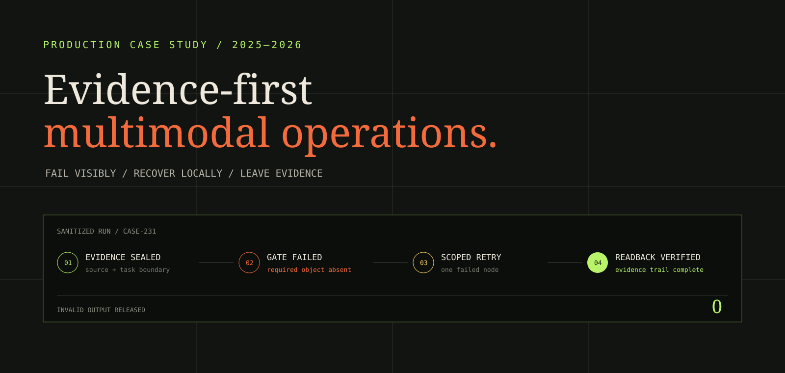
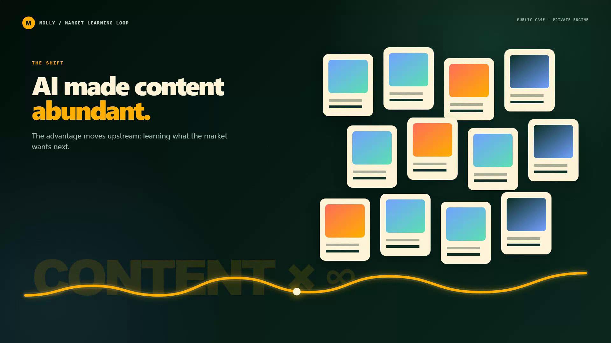
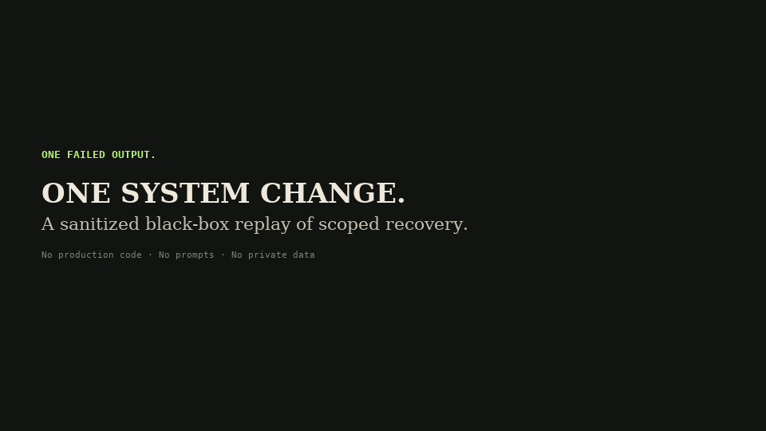
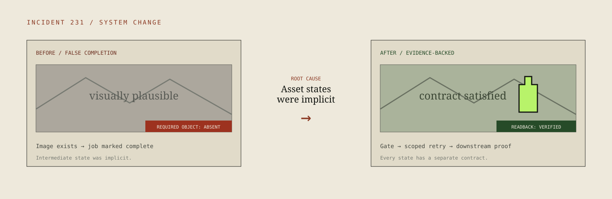

# Molly: Behavior-Led Media Agent

> A closed-source production case study about turning observable market behavior into media decisions, then returning real outcomes to the next cycle.



**Molly starts with how the market behaves.** It forms a search-behavior hypothesis, validates it against fresh public signals, identifies the change a person is trying to make, and issues one bounded media decision. Production outcomes return as evidence for the next cycle. Evidence contracts, deterministic gates, human review, scoped retries, and rollback keep the loop accountable.

[View the visual case study](https://l-iquor.github.io/evidence-first-multimodal-agent/) · [Contact Honglin](mailto:farewell13710@gmail.com) · [LinkedIn](https://www.linkedin.com/in/honglin-liao-343066251/)

## 60-second behavior-led media pitch film

[](https://l-iquor.github.io/evidence-first-multimodal-agent/)

The narrated film runs once on page load and remains understandable through captions. It follows this observable sequence:

```text
BEHAVIOR → HYPOTHESIS → LIVE VALIDATION → HUMAN JOB → MEDIA EXECUTION → OUTCOME LEARNING
```

The film shows one sanitized, successful sensing-and-decision run: 120 live source notes become five supported opportunities and one human job—let the evening begin. The same evidence line then carries that decision through production, verification, publishing, and outcome readback. The public run proves the sensing-and-decision portion; the outcome sequence describes the implemented operating loop. Private prompts, credentials, source code, and production data remain excluded. [Open the captioned MP4 directly](https://l-iquor.github.io/evidence-first-multimodal-agent/assets/molly-market-behavior-demo.mp4?v=20260830-pitch).

### What the representative run demonstrates

- **Behavior hypothesis**: starts with language a person might actually type, then expands it into questions, comparisons, intent, and friction.
- **Live market validation**: source posts and engagement evidence determine which parts of the hypothesis move forward.
- **Decision-job interpretation**: each piece receives one job: earn attention, create recognition, explain, build trust, or support purchase.
- **Media action**: titles and copy receive structured search intent, desired change, scene, and product bridge.
- **Outcome learning**: real reading, saving, store, purchase, and refund signals return to the next market cycle.
- **Evidence-safe execution**: empty or stale source states remain visible and preserve the last verified inventory.

## Try the public synthetic sandbox

The case-study page includes a one-click, fictional scenario that visitors can run themselves. It demonstrates the observable product behavior—evaluate, block, recover, and verify—without accepting uploads or connecting to production data, accounts, prompts, policies, or endpoints. The public JavaScript only controls the presentation sequence; it is not the Molly decision engine.

## 16-second auto-running black-box replay



The public page starts this replay automatically: a plausible but wrong image goes in, the AI blocks it because the required product is missing, retries only the failed step, and verifies the repaired output. It uses fictional assets and exposes product behavior—not the production UI or implementation.

**Evidence scope:** a current targeted run covering queue coordination, asset isolation, worker locking, production modes, decision logic, and execution ledgers passed **10/10 workflow suites**. This is targeted integration evidence, not a claim that the entire private production release is green.

## Why this project exists

The market speaks through behavior, while most content production begins from a brand brief. The product problem is turning those behavioral traces into a defensible decision about what content should do, then carrying that decision through live operations and learning from the result.

A visually plausible output can still be unusable: a required product may be absent, source evidence may be lost, text can drift, two jobs can contaminate each other, or a retry can duplicate downstream work. Molly was built around the operational consequence of those failures—not around the novelty of generation.

| Context | Detail |
| --- | --- |
| Environment | Live consumer operations, 2025–2026 |
| My role | Product owner and hands-on builder |
| Core problem | Close the loop between observable market behavior, media action, and real operating outcomes |
| Design goal | Fail visibly, recover locally, and never claim completion without readback evidence |

## The representative incident

One production candidate looked aesthetically complete but omitted the required product. The deeper failure was not the image itself: an intermediate visual reference had been treated as a finished deliverable.

The fix was a system change, not another prompt:

1. Separate source evidence, intermediate assets, and deliverables into explicit contracts.
2. Require multimodal preflight before a candidate can enter review.
3. Reject invalid candidates at the exact failed node.
4. Retry only the affected stage in an isolated job context.
5. Read the accepted artifact back before marking the job complete.
6. Preserve an audit trail linking the deliverable to its evidence and decisions.



## Reliability loop

```text
OBSERVE → CONTRACT → GENERATE → GATE → RECOVER → DELIVER
   evidence      bounded task      candidate    evaluation    scoped retry    readback proof
```

The model handles interpretation and generation. Deterministic code and explicit human decisions control what may move forward.

### Capabilities demonstrated

- **Evidence grounding** — every accepted result can be traced to its source material and task contract.
- **Multimodal evaluation** — required objects, visual integrity, copy constraints, and deliverable completeness are checked before release.
- **Job isolation** — each task receives its own evidence bundle and execution context to reduce cross-task contamination.
- **Scoped recovery** — failures return to one upstream node instead of restarting or silently accepting a degraded result.
- **Human authority** — review can approve, reject, or request evidence; the agent cannot manufacture approval.
- **Operational readback** — completion depends on verified downstream state, not a successful model response.

## What this demonstrates about my work

I translate ambiguous frontline operations into product boundaries, state transitions, evaluation criteria, recovery paths, and interfaces that people can actually run. The work spans product discovery, workflow architecture, prompt and context orchestration, API integration, test harnesses, observability, and adoption.

This case is most relevant to **Forward Deployed AI Engineer**, **Applied AI Product**, **AI Solutions**, and **Agent Product** roles.

## Deliberately not open sourced

This repository is a portfolio case study, not the Molly implementation. The production system remains private because it contains proprietary operating knowledge and security-sensitive integrations.

The following are intentionally excluded:

- production source code and deployment scripts;
- prompts, policy thresholds, evaluation rubrics, and recovery rules;
- platform adapters, account routing, and authentication flows;
- private datasets, source libraries, brand assets, and generated inventory;
- internal schemas, identifiers, logs, and operational dashboards.

The diagrams communicate the engineering decisions without releasing a cloneable runtime. A private walkthrough can be provided during a serious interview under an appropriate confidentiality boundary.

## About the builder

**Honglin Liao** is an applied AI product builder with experience across live commercial operations, financial products, investment workflows, data reconciliation, and agent systems. He builds from workflow discovery through architecture, evaluation, deployment, and adoption.

Email: [farewell13710@gmail.com](mailto:farewell13710@gmail.com)<br>
LinkedIn: [honglin-liao-343066251](https://www.linkedin.com/in/honglin-liao-343066251/)

---

© 2026 Honglin Liao. All rights reserved. See [NOTICE.md](NOTICE.md).
